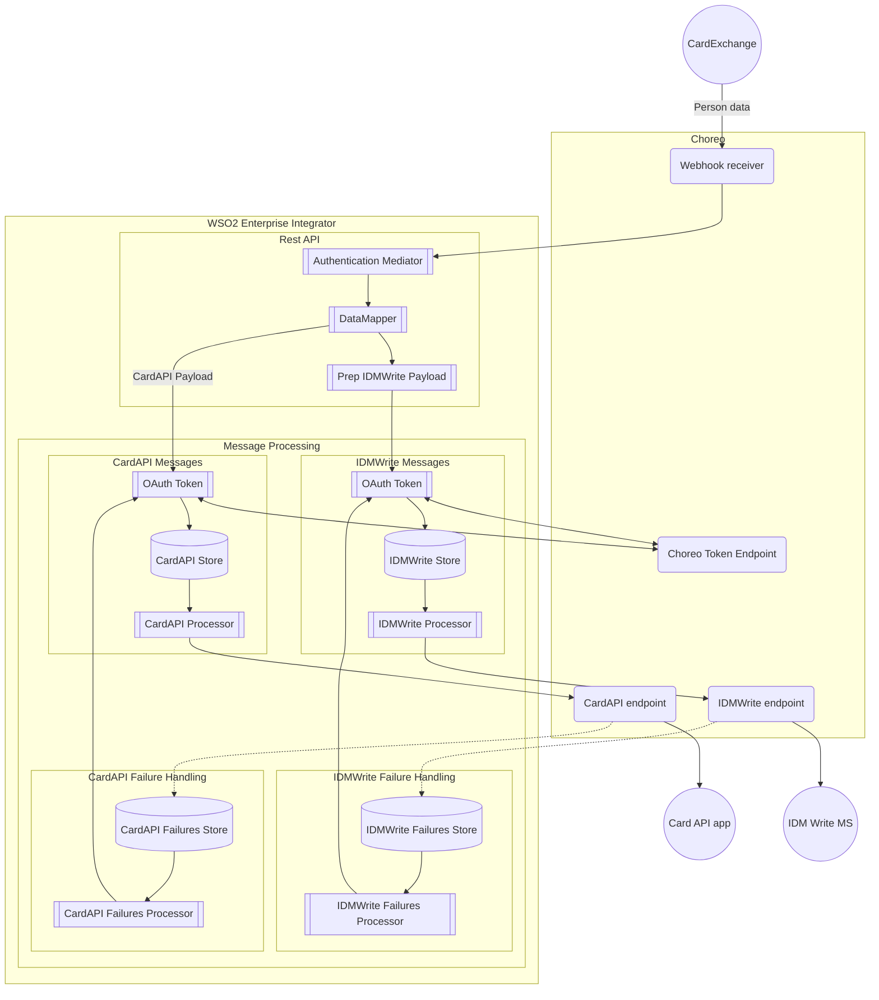

# CardExchange Integration

This is the WSO2 configuration to handle webhook callbacks from CardExchange.

When a card is issued or blocked in CardExchange, it triggers a POST request to a webhook with a JSON payload 
containing the person's details. From this, the integration extracts the current active card details (if available), 
and send them to IDM and CardAPI. CardAPI updates the person's photo in the Datastore and maintains the legacy CardDB 
table until it's no longer needed by downstream systems. IDM keeps the authoritative record of the person's current 
card numbers, including the Card Number, Mifare Chip Serial Number, and Library Number.

## Data flow
This flowchart summarises just the main data flow in this integration. 

## Dependencies

### WSO2
Following environment variables should be configured when deploying this component in Choreo.

| Variable Name           | Example                                                          |
|-------------------------|------------------------------------------------------------------|
| `CARDEXCH_USERNAME`     | `The App's Client Key in Choreo`                                 |
| `OAUTH_TOKEN_ENDPOINT`  | `https://api.asgardeo.io/t/universityofedinburgh/oauth2/token`   |
| `IDM_WRITE_ENDPOINT`    | `https://dev.api.ed.ac.uk/identity/idm/v1/persons`               |
| `CARD_API_ENDPOINT`     | `https://dev.api.ed.ac.uk/card/card/v1/cardexchange`             |
| `jmsurl`                | `tcp://localhost:61616`                                          |
| `jmsuser`               | `system`                                                         | 

Following secrets should be configured when deploying this component in Choreo.

| Secret Name         | Purpose                                     |
|---------------------|---------------------------------------------|
| `CARDEXCH_PASSWORD` | `The App's Client Secret in Choreo`         |
| `SIG_CARDEXCH_KEY`  | `The CardExchange signature verifying key`  |
| `jmspass`           | `to authenticate Amazon MQ`                 |

## Local Development

### Development Tools

- Integration Studio from WSO2. This is a customised Eclipse editor and comes bundled with Micro Integrator and can be used for most development and basic testing.
- Alternatively there is a WSO2 Enterprise Integrator Plugin for VSCode.
- UoE WSO2 Docker. Our own preconfigured docker instance with everything needed for local development: \
  <https://gitlab.is.ed.ac.uk/core-software/wso2docker>
- a Mocklab <https://app.mocklab.io/> account or similar to mock API calls during development.

## Deployment

Deployment is all managed through Choreo.

## Release notes

- 2024 November 24th:   
  migration and deployment to Choreo.
